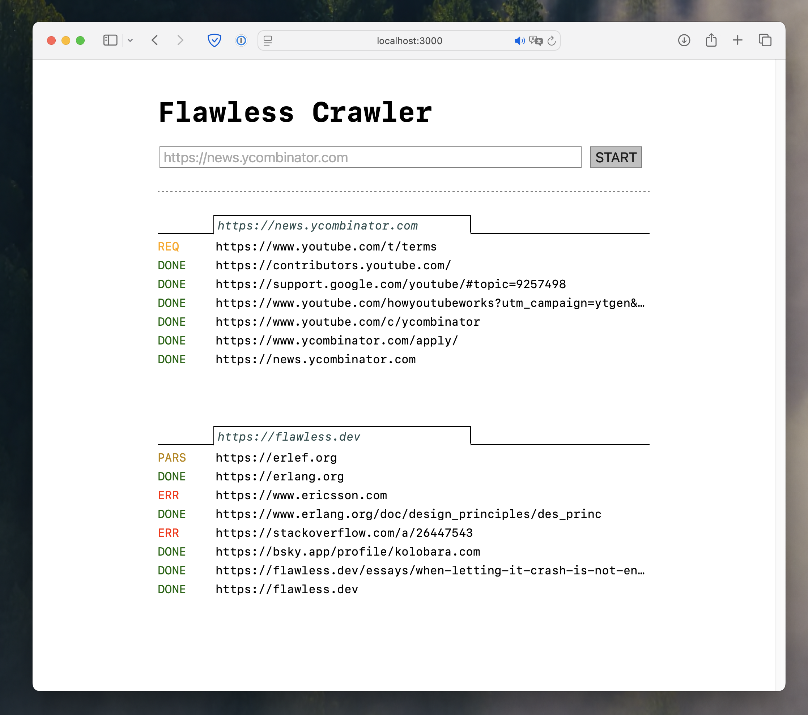

This is an example project that shows how to integrate flawless workflows into native
Rust projects, following the guidelines at https://flawless.dev/docs/integration-with-rust/.

It's a web crawler where the web UI is implemented using [Axum](https://github.com/tokio-rs/axum)
and [HTMX](https://htmx.org), but the crawling is implemented as a workflow in the
`workflows/crawler/src/lib.rs` file.

### Screenshot

